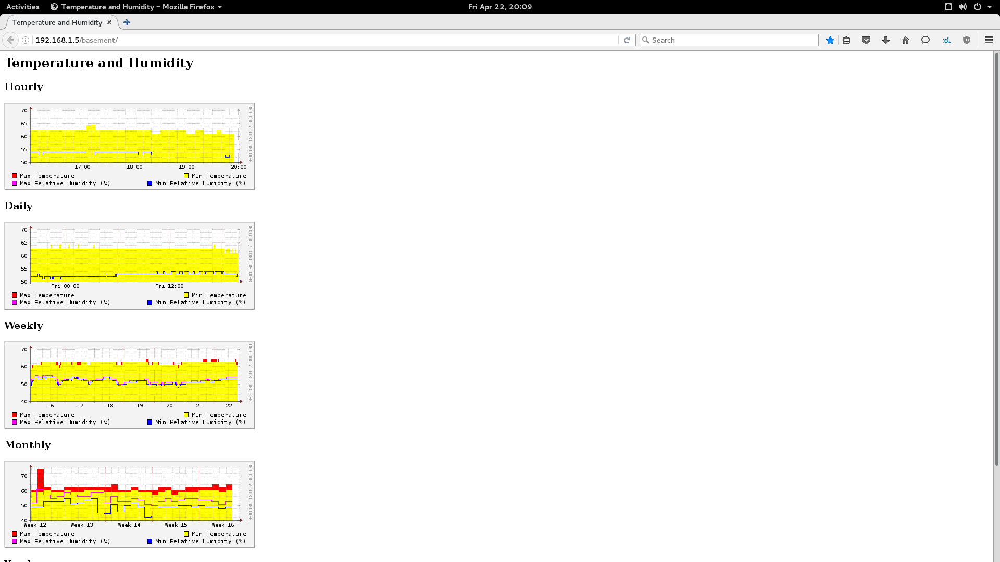

# pi-logger

This program uses a DHT22 temperature / humidity sensor, a
Raspberry Pi 2 and rrdtool to log the temperature and humidity
over time.

## Screenshot

## Installation

* `apt-get install wiringpi rrdtool`
* `make`
* Update the paths in _systemd/pi-logger-create-graphs.service_ and
  _systemd/pi-logger-create-gatherer.service_ to point to where you have
  the source checked out.
* Update the GPIO pin number in
  _systemd/pi-logger-create-graphs.service_. See http://pinout.xyz/ to
  look up the pin number.
* `sudo make install`
* Symlink the _web_ directory somewhere into your web root

