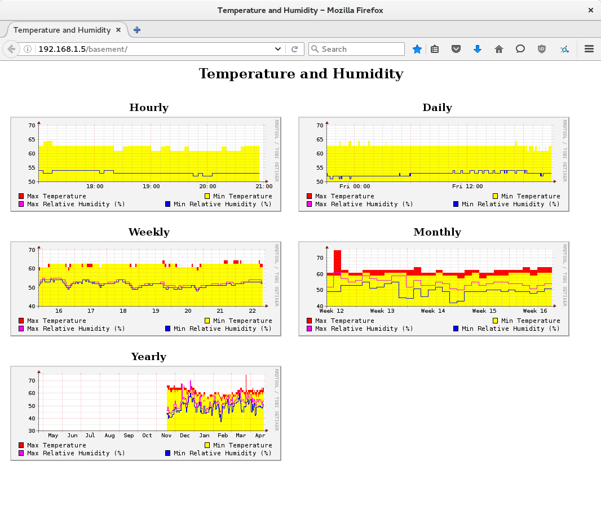

# pi-logger

This program uses a temperature / humidity sensor, a
Raspberry Pi 2 and rrdtool to log the temperature and humidity
over time.

## Screenshot

## Supported temperature and humidity sensors

* [DHT11](http://droboticsonline.com/ebaydownloads/DHT11DATASheetDFR0067.pdf)
* [DHT22](https://www.sparkfun.com/datasheets/Sensors/Temperature/DHT22.pdf)

## Installation

* `apt-get install wiringpi rrdtool`
* `make`
* Update the paths in _systemd/pi-logger-create-graphs.service_ and
  _systemd/pi-logger-create-gatherer.service_ to point to where you have
  the source checked out.
* Update the GPIO pin number, sensor type, and min/max allowed
  temperature range (in celsius) in
  _systemd/pi-logger-gatherer.service_. See http://pinout.xyz/ to look
  up the pin number required by wiringPi.
* `sudo make install`
* Symlink the _web_ directory somewhere into your web root

